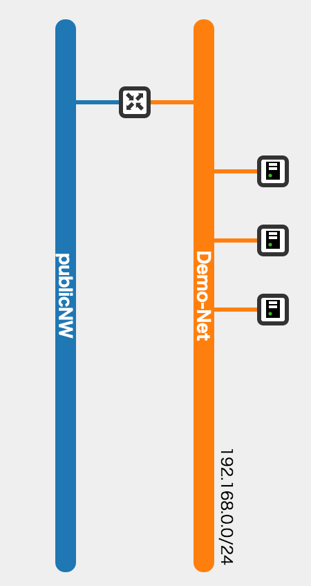

# Openstack SDK 入門

Nobuteru Nishida(@n-nishida on github)


---
## Agenda

- What's SDK?
- Openstack SDK
- python-XXXXXclient
- python-openstacksdk
- DEMO

---
## Agenda

- **<font color='#39c'>What's SDK?</font>**
- Openstack SDK
- python-XXXXXclient
- python-openstacksdk
- DEMO

---
## 　Before SDK...

- API
- CLI

---
## API

- ここでは、WebAPIのことを言います。(Webサービスも類語)  
  - 本来は違う意味だが、一部の人はWebAPIの意味でRESTという言葉を使う人もいる…
- WebAPIは、HTTPでリクエストを受け取り、
- リクエストに応じた処理を行い、
- 処理の結果をユーザに、HTTPでレスポンスする。
- HTTPで仕様が定義されており、
- HTTPに対応したプログラムであれば利用できる。
  - 処理の自動化が可能。

---
## API Definition(ie: Server Reboot)

- URL
```
(POST)http://APIサーバーのホスト/v2/{tenant_id}​/servers/​{server_id}​/action
```
- Header
```
### 認証トークンなど
X-Auth-Token: 93e34d80815d4c78a80182ad7cb565a6
```
- Body
```
### json形式
{
    "reboot": { "type": "SOFT" }
}
```
- Using API by curl
```
curl http://~/action -X POST -H "X-Auth-Token: 93e34~~~" -d '{"reboot":{"type":"SOFT"}}'
```

---
## APIの弱点

- とにかく実行するのが面倒  
  - 認証トークンを毎回入力する必要がある
  - headerやbodyを作る必要がある
  - サーバーのIDなど実行したいリソースに割り当てたIDを記憶する必要がある

---
# そこで…

---
## CLI

- コマンドラインインターフェースの略。  
- CLIは、ユーザが実行しやすいコマンド体系を持ち、
- ユーザは、シェルからコマンドを実行できる。
- コマンドに応じて、CLIはHTTPリクエストを発行し、
- APIから受け取った結果をユーザへ返す。  
  - json形式ではなく、テーブル形式などの見やすいフォーマットで返してくれるような実装も多い。

---
## CLI Definition(ie: Server Reboot)
- Using API by CLI
```
nova reboot [--hard] [--poll] <server>
```

---
## SDK

- 各種言語(python, ruby and so on)でAPIを使うため、
- APIの処理（メソッド）や利用データ（プロパティ）を
- サーバーなど<font color='#39c'>実体に則したObject</font>としてまとめたもの。
- 各種言語は、<font color='#39c'>SDKに定義されたObject</font>を介して、
  - import <font color='#39c'>server_manager</font>
- APIの処理を実行したり、結果を取得できる。
  - <font color='#39c'>server</font> = <font color='#39c'>server_manager</font>.create(name=xxxx, image=yyyyy, ...)
  - server_id = <font color='#39c'>server</font>.id
  - <font color='#39c'>server</font>.reboot()

---
## SDKの利点
- CLI+シェルに比べ、SDK+各種言語のほうが高機能で使いやすい。
  - オブジェクト指向
  - 変数にオブジェクトを代入できる。
  - 基本構文が高機能(for, if, 計算, 置換)
  - 使いやすいマルチスレッド、プロセス間通信、デーモン

---
## API・SDK・CLIの性格
- 使いやすさ: API < SDK < CLI
- 実装の自由度: API > SDK > CLI


---
## Agenda

- What's SDK?
- **<font color='#39c'>Openstack SDK</font>**
- python-XXXXXclient
- python-openstacksdk
- DEMO

---
## Openstack SDKs

- for python
  - python-xxxxxclient(official)
    - python-novaclient
    - python-neutronclient
    - python-glanceclient
    - python-keystoneclient
    - python-swiftclient
    - python-cinderclient
    - python-ceilometerclient
    - python-heatclient
  - python-openstacksdk(unofficial)

---
## Openstack SDKs

- for ruby
  - Aviator
  - fog
- other languages
  - Keystone and Swift libraries(C)
  - lfe-openstack(Erlang)
  - OpenStack-SDK-Go(Go)

---
## Openstack SDKs
- SDKは数あるものの、開発途上のものも多い。
- Openstack自体はPython製であるため、
- 現状python-XXXXXclientが多く使われる。
- またFogのようにマルチクラウド対応のSDKもある。
  - AWSやOpenstackのような異なるテナントに対して、
  - 同じオブジェクトから操作できる。


---
### 詳細は 
### https://wiki.openstack.org/wiki/SDKs

---
## Agenda

- What's SDK?
- Openstack SDK
- **<font color='#39c'>python-XXXXXclient</font>**
- python-openstacksdk
- DEMO

---
## python-clients as SDK
- 各プロジェクトで独自の実装
  - 設計(Object構成)がプロジェクトごとに大分異なる。
    - DEMOの中で一例を説明します。
- バックエンドであるAPIバージョンの対応状況
  - nova: v2のみ対応。
    - v1.1やv3を指定してもv2用のSDKが使われる
  - neutron: v2対応
  - keystone: v2/v3対応
  - glance: v1/v2対応
  - cinder: v1/v2対応

---
## use nova and neutron client as SDK easily
- ipython(インタラクティブインタプリタ)を使う
  - pythonの処理を一行づつ、シェルのように実行可能
  - python2.6では使用不可。pythonコマンドで代用可
    - ipythonのほうがユーザーフレンドリーで機能豊富
      （カラー表示、補完、インデント、デバッグなど）

```
pip install ipython
### or python command
ipython 
In [1]: print("Hello World")
Hello World
```

---
## use nova and neutron client as SDK easily
- ipythonで以下の処理をコピペする。
  - novaとneutronクライアントのオブジェクトを取得
    ※CLIを使えることが前提

```
import os
### import from SDK
from novaclient.client import Client as NovaClient
from neutronclient.v2_0.client import Client as NeutronClient
from keystoneclient.auth.identity import v2
from keystoneclient import session
### create keystone auth information object
auth = v2.Password(auth_url=os.environ["OS_AUTH_URL"],
                   username=os.environ["OS_USERNAME"],
                   password=os.environ["OS_PASSWORD"],
                   tenant_name=os.environ["OS_TENANT_NAME"])
### create keystone session and access to nova and neutron.
nova_client = NovaClient(2, session=session.Session(auth=auth))
neutron_client = NeutronClient(session=session.Session(auth=auth))
```

---
## use nova and neutron client as SDK easily
- オブジェクトが持つメソッドやプロパティには、
- "obj.method"や"obj.property"でアクセスできる。
  - ipythonはメソッドやプロパティを一覧表示してくれる。
  - "nova_client."まで入れて、tabを押した場合の挙動

```
In [25]: nova_client.
nova_client.agents                        nova_client.fping                         nova_client.security_group_rules
nova_client.aggregates                    nova_client.get_timings                   nova_client.security_groups
nova_client.authenticate                  nova_client.hosts                         nova_client.server_groups
nova_client.availability_zones            nova_client.hypervisor_stats              nova_client.servers
nova_client.certs                         nova_client.hypervisors                   nova_client.services
nova_client.client                        nova_client.images                        nova_client.set_management_url
nova_client.cloudpipe                     nova_client.keypairs                      nova_client.tenant_id
nova_client.dns_domains                   nova_client.limits                        nova_client.usage
…略

```

---
## use nova and neutron client as SDK easily
- オブジェクトを使い、サーバ一覧を取得する。
- サーバー一覧は、nova_client.servers.list()で取得可能
  - nova_clientは、serversというプロパティを持つ
  - serversは、ServerManagerインスタンスオブジェクト
  - インスタンスオブジェクトは、listメソッドを持つ。
    - プロパティかメソッドかは、()の有無で分かる。
  - 結果、Serverオブジェクトが3件配列で戻ってきた。

```
In [24]: nova_client.servers
Out[24]: <novaclient.v2.servers.ServerManager at 0x26d3210>
In [25]: nova_client.servers.list()
Out[25]: [<Server: demo_server2>, <Server: demo_server1>, <Server: demo_server0>]
```

---
## use nova and neutron client as SDK easily
- サーバ一覧をfor文で回してnameを取得する。
  - サーバー一覧処理の戻り値を変更にserversへ代入
  - servers配列をfor文で回す。
    - ipythonはindentも自動で補完してくれるの便利
    - for文を全て入力するまで処理は始まらない

```
In [29]: servers = nova_client.servers.list()
　
In [30]: for server in servers:
   ....:     print server.name
   ....:     if server.name == "demo_server1":
   ....:         print "I am " + server.name
demo_server2
demo_server1
I am demo_server1
demo_server0
```

---
## challenge
- nova_clientやneturon_clientには、  
  他にも様々なオブジェクトがあります。  
  tab補完などを駆使し、  
  オブジェクトからメソッドを実行し、  
  プロパティを確認してみましょう。

---
## Agenda

- What's SDK?
- Openstack SDK
- python-XXXXXclient
- **<font color='#39c'>python-openstacksdk</font>**
- DEMO

---
## python-openstacksdk
- コネクションクラスから始まり、コネクションオブジェクトから、全サービスのクライアントを取得
- 既存のpython-clientsのようにクライアントの取得のために、別途、認証情報を渡す必要がない。
```
### 処理イメージ
conn = connection.Connection(**auth_args)
flavors = conn.compute.list_flavors()
routers = conn.network.list_routers()
```

---
## python-openstacksdk
- kilohalfでαリリース予定
  - 今回はDEMOで利用してみたものの、バグに3〜4件ほど遭遇。
    - novaのaction系メソッドがput
    - service.find_XXXXX(network/server)メソッドがidしか返さない仕様
    - server_floating_ip.deleteメソッドがそのままだと機能しない
  - 試行錯誤しながら、DEMO実装はできたものの、まだリリース前でもあり実用は難しそう。


---
## Agenda

- What's SDK?
- Openstack SDK
- python-XXXXXclient
- python-openstacksdk
- **<font color='#39c'>DEMO</font>**

---
## DEMO内容
- サーバー環境を構築するツール
  - create_by_python-clients.py
  - create_by_python-openstacksdk.py
- サーバー環境を削除するツール
  - delete_by_python-clients.py
  - delete_by_python-openstacksdk.py
- python-clients版と、openstacksdk版があります。どちらも機能は全く同一です。

---
## Before 


---
## After  




---
## 事前準備
  - Openstack環境を準備
    - regionやavailability_zoneは1つ
    - novaのAPIはv2
    - keystoneのAPIはv2
  - 以下の環境変数を設定
    - OS_AUTH_URL, OS_USERNAME  
      OS_PASSWORD, OS_TENANT_NAME  
  - githubからデモツールのソースコードを取得。
  - requirements.txtからライブラリインストール
  
```
source path/to/your/openrc
git clone https://github.com/n-nishida/demo-python-openstacksdk
cd demo-python-openstacksdk
pip install -r requirements.txt
```

---
## 実行(python-client版)

```
python create_by_python-clients.py 
  --external_network_name publicNW 
  --external_network_dns_server_ip_address 192.168.100.254 
  --cidr_can_connect_to_server 192.168.100.0/24 
  --server_image_name centos-base 
  --server_flavor_name m1.xsmall 
  --server_count 3
python delete_by_python-clients.py
```

---
## 実行(python-openstacksdk版)

```
python create_by_python-openstacksdk.py 
  --external_network_name publicNW 
  --external_network_dns_server_ip_address 192.168.100.254 
  --cidr_can_connect_to_server 192.168.100.0/24 
  --server_image_name centos-base 
  --server_flavor_name m1.xsmall 
  --server_count 3
python delete_by_python-openstacksdk.py
```


---
## create成功時の標準出力

```
create router         : Demo-Router
create network        : Demo-Net
create subnet         : Demo-Subnet
add router interface...
create security_group : Demo-Securitygroup
create keypair        : Demo-Keypair
create keypair file   : Demo-Keypair.pem
　
id of demo_server0            : 767a4c64-754d-421a-aeb5-a7b6bbaab333
fixed_ip of demo_server0      : 192.168.0.2
floating_ip of demo_server0   : 192.168.100.213
　
id of demo_server1            : d477e2a4-f8cf-4e08-a6c7-c3fe62842e8e
fixed_ip of demo_server1      : 192.168.0.4
floating_ip of demo_server1   : 192.168.100.214
　
id of demo_server2            : b2eddf39-30ff-4398-bf73-d00600362098
fixed_ip of demo_server2      : 192.168.0.5
floating_ip of demo_server2   : 192.168.100.215
　
...Finished!
You can connect to server by using following command
ssh -i Demo-Keypair.pem user@server
```


---
## delete成功時の標準出力

```
deleting floating_ip    : 192.168.100.215
deleting server         : demo_server2
deleting floating_ip    : 192.168.100.214
deleting server         : demo_server1
deleting floating_ip    : 192.168.100.213
deleting server         : demo_server0
deleting security_group : Demo-Securitygroup
deleting keypair        : Demo-Keypair
deleting subnet         : Demo-Subnet
deleting network        : Demo-Net
deleting router         : Demo-Router
...Finished!
```

---
## コード解説
- pythonライブラリ関連
  - ConfigParserライブラリ
  - clickライブラリ
- python_clients関連
  - 非同期処理の考慮
    - server.delete()はAPI側では非同期処理  
      そのため、serverが削除される前にネットワークを  
      削除しようとするとエラーになるので注意。


---
## コード解説
- python_clients関連
  - nova_clientの仕様
    - Serverに代表される各リソースのManagerオブジェクトを持つ
    - 各Managerは、リソースのAPIと紐付いたメソッド群を持つ
    - このメソッドの戻り値は、基本的にリソースオブジェクト
    - リソースオブジェクトからも、同様に自身に対する操作が可能。
```
nova_client.servers         # ServerManager obj
nova_client.servers.list()  # return Server objs
```

---
## コード解説
- python_clients関連
  - neutron_clientの仕様
    - APIと直接紐付いたメソッド群を持つ
    - メソッドの戻り値は、基本的にディクト型を返す

---
## まとめ
- SDKを使うと、
  - CLIでは実装が難しい分岐処理がより簡単
  - 豊富なライブラリを利用することが可能
- python-clientsは、
  - プロジェクトごとに独自の実装なので個別調査が必要
- python-openstacksdkは、
  - 操作の作法が一定で、統一されている。
  - 一方で、まだバグも多く今後に期待。


---
### ご清聴ありがとうございました！
